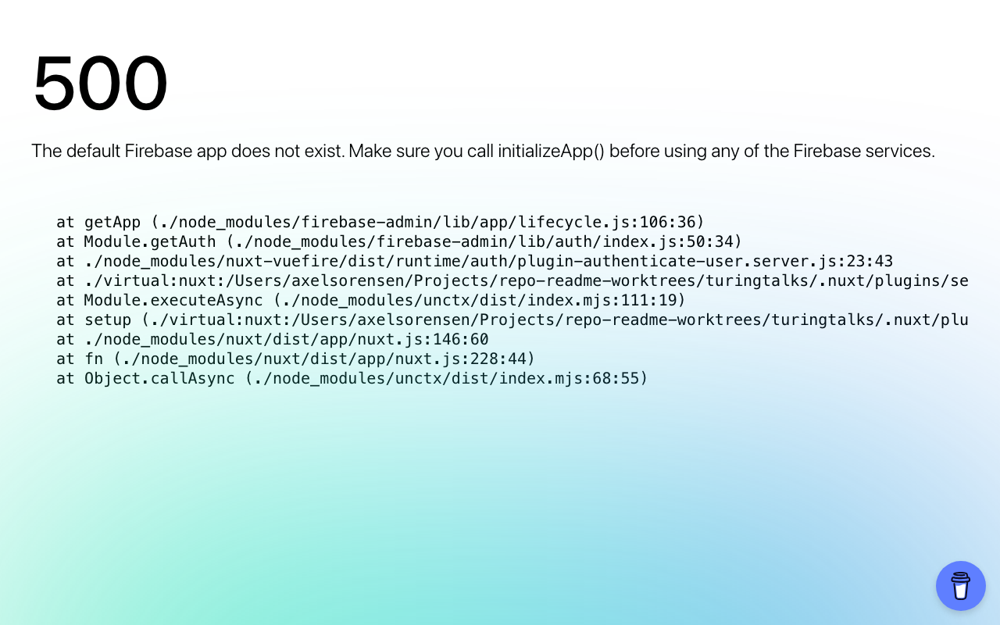

# 🎙️ The Turing Talks

Website for "The Turing Talks" — billed as the first AI-hosted podcast about AI — with episode listings, admin tools, and listener suggestions.


*This is the 500 error page you get **without valid Firebase Admin credentials** — expected, not a bug. `nuxt-vuefire`'s server-side auth plugin needs a real service account to initialize the Firebase Admin app; every route 500s until one is provided (see [Environment variables](#environment-variables) below). With valid credentials this renders the actual site.*

## Features

- 🎧 **Episode listing & detail pages** — browse episodes at `/episodes` and view individual episodes at `/episodes/[id]`
- 📝 **Listener suggestions** — a suggestion form on the homepage (`PostSuggestion`) lets visitors propose topics
- 🛠️ **Admin panel** — an `/admin` area for creating episodes: title, sources, description, audio URL, and duration
- 👤 **Profile & signup** — `/profile` and `/signup` pages, gated by `middleware/`
- ✉️ **Email support** — an `/email` route plus `nodemailer` dependency for sending mail
- 🔥 **Firebase-backed** — Firestore/Auth via `firebase` and `firebase-admin`, deployed with `firebase-functions`

## Installation

```bash
git clone <this repo>
cd turingtalks
npm install
```

You'll need Firebase credentials configured (the app expects a service account and client config for Firestore/Auth/Functions) — see [Environment variables](#environment-variables) below.

## Usage

```bash
npm run dev
```

Then open the local dev server URL printed in the terminal.

## Environment variables

Unlike most Nuxt apps, this project doesn't read Firebase config from `.env` — the client-side Firebase config is hardcoded directly in `nuxt.config.ts` under `vuefire.config`, and the server-side Firebase **Admin** SDK (used by `nuxt-vuefire`'s SSR auth plugin) needs a **service account JSON file**, not env vars.

To run this with your own Firebase project:

1. In the Firebase console, go to Project settings > Service accounts > Generate new private key. This downloads a JSON file.
2. Save that file as `service-account.json` in the repo root (this is the exact filename `nuxt-vuefire` looks for by default — the file currently checked into the repo is a placeholder/non-working one and should be treated as such, not as a real credential).
3. Update the `vuefire.config` block in `nuxt.config.ts` with your own project's client config (`apiKey`, `authDomain`, `projectId`, etc.) from Project settings > General > Your apps.

Without a valid `service-account.json`, every server-rendered route will 500 with "The default Firebase app does not exist" (see the screenshot above) — this is expected, not a bug.

**Security note:** a `service-account.json` is a private credential and should never be committed to a public repo. Rotate the one currently checked in and add `service-account.json` to `.gitignore` going forward.

## Built with

- [Nuxt 3](https://nuxt.com/) / Vue 3
- Pinia
- Firebase, Firebase Admin, Firebase Functions
- Tailwind CSS

## Status

⚠️ Runs, but requires real Firebase Admin credentials to serve pages — `npm install && npm run dev` starts cleanly as of 2026-09-03, but every route 500s with "The default Firebase app does not exist" because `nuxt-vuefire`'s server-side auth plugin needs a valid service account (the checked-in `service-account.json` is not a working one). Active-looking content site with real admin/CRUD flows for episodes — note that a `service-account.json` file is checked into the repo, which should be rotated and removed from git history before this repo is made public or shared further.
